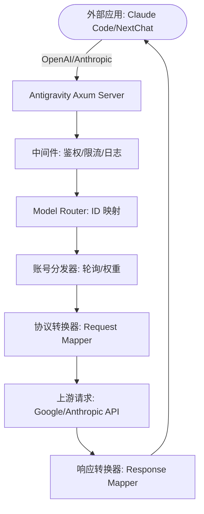

# Antigravity Tools 🚀
> 专业的 AI 账号管理与协议反代系统 (v3.3.18)
<div align="center">
  

  <h3>您的个人高性能 AI 调度网关</h3>
  <p>不仅仅是账号管理，更是打破 API 调用壁垒的终极解决方案。</p>
  
  <p>
    <a href="https://github.com/lbjlaq/Antigravity-Manager">
      
    </a>
    
    
    
    
  </p>

  <p>
    <a href="#-核心功能">核心功能</a> • 
    <a href="#-界面导览">界面导览</a> • 
    <a href="#-技术架构">技术架构</a> • 
    <a href="#-安装指南">安装指南</a> • 
    <a href="#-快速接入">快速接入</a>
  </p>

  <p>
    <strong>简体中文</strong> | 
    <a href="./README_EN.md">English</a>
  </p>
</div>

---

**Antigravity Tools** 是一个专为开发者和 AI 爱好者设计的全功能桌面应用。它将多账号管理、协议转换和智能请求调度完美结合，为您提供一个稳定、极速且成本低廉的 **本地 AI 中转站**。

通过本应用，您可以将常见的 Web 端 Session (Google/Anthropic) 转化为标准化的 API 接口，彻底消除不同厂商间的协议鸿沟。

## 💖 赞助商 (Sponsors)

|  | 感谢 **PackyCode** 对本项目的赞助！PackyCode 是一家可靠高效的 API 中转服务商，提供 Claude Code、Codex、Gemini 等多种服务的中转。PackyCode 为本项目的用户提供了特别优惠：使用[此链接](https://www.packyapi.com/register?aff=Ctrler)注册，并在充值时输入 **“Ctrler”** 优惠码即可享受 **九折优惠**。 |
| :--- | :--- |

## 🌟 深度功能解析 (Detailed Features)

### 1. 🎛️ 智能账号仪表盘 (Smart Dashboard)
*   **全局实时监控**: 一眼洞察所有账号的健康状况，包括 Gemini Pro、Gemini Flash、Claude 以及 Gemini 绘图的 **平均剩余配额**。
*   **最佳账号推荐 (Smart Recommendation)**: 系统会根据当前所有账号的配额冗余度，实时算法筛选并推荐“最佳账号”，支持 **一键切换**。
*   **活跃账号快照**: 直观显示当前活跃账号的具体配额百分比及最后同步时间。

### 2. 🔐 强大的账号管家 (Account Management)
*   **OAuth 2.0 授权（自动/手动）**: 添加账号时会提前生成可复制的授权链接，支持在任意浏览器完成授权；回调成功后应用会自动完成并保存（必要时可点击“我已授权，继续”手动收尾）。
*   **多维度导入**: 支持单条 Token 录入、JSON 批量导入（如来自其他工具的备份），以及从 V1 旧版本数据库自动热迁移。
*   **网关级视图**: 支持“列表”与“网格”双视图切换。提供 403 封禁检测，自动标注并跳过权限异常的账号。

### 3. 🔌 协议转换与中继 (API Proxy)
*   **全协议适配 (Multi-Sink)**:
    *   **OpenAI 格式**: 提供 `/v1/chat/completions` 端点，兼容 99% 的现有 AI 应用。
    *   **Anthropic 格式**: 提供原生 `/v1/messages` 接口，支持 **Claude Code CLI** 的全功能（如思思维链、系统提示词）。
    *   **Gemini 格式**: 支持 Google 官方 SDK 直接调用。
*   **智能状态自愈**: 当请求遇到 `429 (Too Many Requests)` 或 `401 (Expire)` 时，后端会毫秒级触发 **自动重试与静默轮换**，确保业务不中断。

### 4. 🔀 模型路由中心 (Model Router)
*   **系列化映射**: 您可以将复杂的原始模型 ID 归类到“规格家族”（如将所有 GPT-4 请求统一路由到 `gemini-3-pro-high`）。
*   **专家级重定向**: 支持自定义正则表达式级模型映射，精准控制每一个请求的落地模型。
*   **智能分级路由 (Tiered Routing)**: [新] 系统根据账号类型（Ultra/Pro/Free）和配额重置频率自动优先级排序，优先消耗高速重置账号，确保高频调用下的服务稳定性。
*   **后台任务静默降级**: [新] 自动识别 Claude CLI 等工具生成的后台请求（如标题生成），智能重定向至 Flash 模型，保护高级模型配额不被浪费。

### 5. 🎨 多模态与 Imagen 3 支持
*   **高级画质控制**: 支持通过 OpenAI `size` (如 `1024x1024`, `16:9`) 参数自动映射到 Imagen 3 的相应规格。
*   **超强 Body 支持**: 后端支持高达 **100MB** 的 Payload，处理 4K 高清图识别绰绰有余。

## 📸 界面导览 (GUI Overview)


### 💡 使用案例 (Usage Examples)


## 🏗️ 技术架构 (Architecture)



##  安装指南 (Installation)

### 选项 A: 终端安装 (macOS & Linux 推荐)
如果您已安装 [Homebrew](https://brew.sh/)，可以通过以下命令快速安装：

```bash
# 1. 订阅本仓库的 Tap
brew tap lbjlaq/antigravity-manager https://github.com/lbjlaq/Antigravity-Manager

# 2. 安装应用
brew install --cask antigravity-tools
```
> **提示**: 
> - **macOS**: 如果遇到权限问题，建议添加 `--no-quarantine` 参数。
> - **Linux**: 安装后会自动将 AppImage 添加到二进制路径并配置可执行权限。

### 选项 B: 手动下载
前往 [GitHub Releases](https://github.com/lbjlaq/Antigravity-Manager/releases) 下载对应系统的包：
*   **macOS**: `.dmg` (支持 Apple Silicon & Intel)
*   **Windows**: `.msi` 或 便携版 `.zip`
*   **Linux**: `.deb` 或 `AppImage`

### 🛠️ 常见问题排查 (Troubleshooting)

#### macOS 提示“应用已损坏，无法打开”？
由于 macOS 的安全机制，非 App Store 下载的应用可能会触发此提示。您可以按照以下步骤快速修复：

1.  **命令行修复** (推荐):
    打开终端，执行以下命令：
    ```bash
    sudo xattr -rd com.apple.quarantine "/Applications/Antigravity Tools.app"
    ```
2.  **Homebrew 安装技巧**:
    如果您使用 brew 安装，可以添加 `--no-quarantine` 参数来规避此问题：
    ```bash
    brew install --cask --no-quarantine antigravity-tools
    ```

## 🔌 快速接入示例

### 🔐 OAuth 授权流程（添加账号）
1. 打开“Accounts / 账号” → “添加账号” → “OAuth”。
2. 弹窗会在点击按钮前预生成授权链接；点击链接即可复制到系统剪贴板，然后用你希望的浏览器打开并完成授权。
3. 授权完成后浏览器会打开本地回调页并显示“✅ 授权成功!”。
4. 应用会自动继续完成授权并保存账号；如未自动完成，可点击“我已授权，继续”手动完成。

> 提示：授权链接包含一次性回调端口，请始终使用弹窗里生成的最新链接；如果授权时应用未运行或弹窗已关闭，浏览器可能会提示 `localhost refused connection`。

### 如何接入 Claude Code CLI?
1.  启动 Antigravity，并在“API 反代”页面开启服务。
2.  在终端执行：
```bash
export ANTHROPIC_API_KEY="sk-antigravity"
export ANTHROPIC_BASE_URL="http://127.0.0.1:8045"
claude
```

### 如何接入 Kilo Code?
1.  **协议选择**: 建议优先使用 **Gemini 协议**。
2.  **Base URL**: 填写 `http://127.0.0.1:8045`。
3.  **注意**: 
    - **OpenAI 协议限制**: Kilo Code 在使用 OpenAI 模式时，其请求路径会叠加产生 `/v1/chat/completions/responses` 这种非标准路径，导致 Antigravity 返回 404。因此请务必填入 Base URL 后选择 Gemini 模式。
    - **模型映射**: Kilo Code 中的模型名称可能与 Antigravity 默认设置不一致，如遇到无法连接，请在“模型映射”页面设置自定义映射，并查看**日志文件**进行调试。

### 如何在 Python 中使用?
```python
import openai

client = openai.OpenAI(
    api_key="sk-antigravity",
    base_url="http://127.0.0.1:8045/v1"
)

response = client.chat.completions.create(
    model="gemini-3-flash",
    messages=[{"role": "user", "content": "你好，请自我介绍"}]
)
print(response.choices[0].message.content)
```

## 📝 开发者与社区

*   **版本演进 (Changelog)**:
    *   **v3.3.18 (2026-01-08)**:
        - **智能限流优化 - 实时配额刷新与精准锁定 (核心致谢 @Mag1cFall PR #446)**:
            - **智能指数退避**: 根据连续失败次数动态调整锁定时间,避免因临时配额波动导致的长时间锁定。
                - 第 1 次失败: 60 秒
                - 第 2 次失败: 5 分钟
                - 第 3 次失败: 30 分钟
                - 第 4 次及以上: 2 小时
            - **实时配额刷新**: 当 API 返回 429 但未提供 `quotaResetDelay` 时,实时调用配额刷新 API 获取最新的 `reset_time`,精确锁定账号到配额恢复时间点。
            - **三级降级策略**:
                - 优先: 使用 API 返回的 `quotaResetDelay`
                - 次优: 实时刷新配额获取 `reset_time`
                - 保底: 使用本地缓存的配额刷新时间
                - 兜底: 使用智能指数退避策略
            - **精准锁定**: 新增 `set_lockout_until_iso` 方法,支持使用 ISO 8601 时间字符串精确锁定账号。
            - **成功重置**: 请求成功后自动重置账号的连续失败计数,避免账号因历史失败记录而被长期锁定。
            - **新增错误类型支持**: 新增 `ModelCapacityExhausted` 错误类型,处理服务端暂时无可用 GPU 实例的情况(15 秒重试)。
            - **优化限流判断**: 修复 TPM 限流被误判为配额耗尽的问题,优先检查 "per minute" 或 "rate limit" 关键词。
            - **影响范围**: 此优化显著提升了多轮对话中的账号可用性和稳定性,解决了频繁 429 错误和账号锁定时间不准确的问题。
        - **模型路由中心 BUG 修复 (Fix Issue #434)**:
            - **修复 GroupedSelect Portal 事件处理**: 解决了自定义下拉选择组件的关键 BUG,修复点击选项时菜单立即关闭导致选择无效的问题。
                - **根本原因**: `createPortal` 将下拉菜单渲染到 `document.body`,但 `handleClickOutside` 只检查 `containerRef`,导致点击选项时被误判为"点击外部"。
                - **解决方案**: 添加 `dropdownRef` 引用下拉菜单,修改 `handleClickOutside` 同时检查容器和下拉菜单,确保点击选项时不会关闭菜单。
                - **影响范围**: 修复了所有 5 个模型家族分组(Claude 4.5、Claude 3.5、GPT-4、GPT-4o、GPT-5)的下拉选择功能。
            - **补充缺失的国际化翻译**: 添加专家精确映射部分缺失的翻译键,解决提示文本不显示的问题。
                - 中文: `money_saving_tip`、`haiku_optimization_tip`、`haiku_optimization_btn`、`select_target_model`
                - 英文: 对应的英文翻译
                - **影响范围**: "💰 省钱提示" 和 "一键优化" 按钮现在正常显示。
            - **统一专家映射表单下拉框**: 将添加映射表单中的原生 `<select>` 替换为自定义 `GroupedSelect` 组件。
                - 添加 `customMappingValue` state 管理选中值
                - 从 `models` 动态生成 `customMappingOptions`
                - 提供一致的用户体验,解决 Windows 透明度问题
            - **用户体验增强**:
                - 添加成功/失败 Toast 提示,用户操作后有明确反馈
                - 添加调试日志便于问题诊断
                - 改进错误处理,失败时显示具体错误信息
        - **macOS 旧版本兼容性修复 (Fix Issue #219)**:
            - **修复添加账号弹窗不显示**: 将 `AddAccountDialog` 中的 `<dialog>` 标签替换为 `<div>`，解决了 macOS 12.1 (Safari < 15.4) 等旧版本系统上点击“添加账号”按钮无反应的问题。
        - **内置直通模型路由修复 (Fix Issue #442, PR #444)**:
            - **修复直通模型被错误拦截**: 解决了 `claude-opus-4-5-thinking` 等内置直通模型在 CLI 模式下被错误地应用家族映射规则（如被重定向到 `gemini-3-pro-high`）的问题。
            - **逻辑优化**: 移除了针对 CLI 请求的直通检查限制，确保内置表中定义的直通模型（key == value）始终拥有最高优先级，绕过家族分组映射。
    *   **v3.3.17 (2026-01-08)**:
        - **OpenAI 协议 Thinking 展示增强 (核心致谢 @Mag1cFall PR #411)**:
            - **新增 reasoning_content 字段支持**: 在 OpenAI 兼容格式中添加 `reasoning_content` 字段,使 Gemini 3 模型的思考过程能够被 Cherry Studio 等客户端正确折叠显示。
            - **思考内容智能分离**: 根据 `thought:true` 标记自动分离思考内容到 `reasoning_content` 字段,正常内容保留在 `content` 字段,提升用户体验。
            - **流式与非流式全面支持**: 在 `streaming.rs` 和 `response.rs` 中同时实现 `reasoning_content` 支持,确保所有响应模式下的一致性。
            - **修复空 Chunk 跳过问题**: 修复了当仅有思考内容时 chunk 被错误跳过的 Bug,现在只有当 `content` 和 `reasoning_content` 都为空时才跳过。
            - **统一流式 ID**: 为所有流式 chunk 使用统一的 `stream_id` 和 `created_ts`,符合 OpenAI 协议规范。
            - **影响范围**: 此功能增强了 Gemini 3 thinking 模型在 Cherry Studio、Cursor 等客户端中的展示效果,思考过程可以被正确折叠,不影响任何现有 v3.3.16 修复。
        - **FastMCP 框架兼容性修复 (核心致谢 @Silviovespoli PR #416)**:
            - **修复 anyOf/oneOf 类型丢失问题**: 解决了 FastMCP 框架生成的 JSON Schema 中 `anyOf`/`oneOf` 被移除后导致字段缺少 `type` 属性的问题。
            - **智能类型提取**: 在移除 `anyOf`/`oneOf` 之前,自动提取第一个非 null 类型到 `type` 字段,确保 Schema 有效性。
            - **修复工具调用静默失败**: 彻底解决了 Claude Code 使用 FastMCP 工具时调用失败但无错误提示的问题 (Issue #379, #391)。
            - **向后兼容**: 仅在字段缺少 `type` 时才提取,已有 `type` 的 Schema 不受影响,确保与标准 MCP Server 的兼容性。
            - **完整测试覆盖**: 新增 4 个单元测试验证 `anyOf`/`oneOf` 类型提取、已有类型保护等场景。
            - **影响范围**: 此修复使 FastMCP 框架构建的 MCP 服务器能够正常工作,不影响标准 MCP Server 和任何现有 v3.3.16 修复。
        - **前端 UI/UX 优化 (核心致谢 @i-smile PR #414)**:
            - **API 代理路由重构**: 使用分组下拉菜单优化专家路由配置界面,提升模型映射配置的可读性和易用性。
            - **账户视图模式持久化**: 使用 localStorage 自动记住用户选择的列表/网格视图模式,提升用户体验。
            - **表格布局优化**: 为配额列设置最小宽度防止压缩,操作列固定在右侧提升小屏幕可访问性。
            - **国际化翻译完善**: 添加缺失的翻译键,移除硬编码字符串,提升多语言支持质量。
            - **影响范围**: 此更新仅涉及前端 UI 改进,不影响任何后端逻辑和现有 v3.3.16/v3.3.17 修复。
        - **自定义分组下拉组件 (Custom Grouped Select)**:
            - **解决 Windows 透明度问题**: 创建自定义 `GroupedSelect` 组件替换原生 `<select>`,解决 Windows 下拉菜单过于透明的问题。
            - **完整深浅模式支持**: 自定义组件完美支持深浅模式切换,提供一致的视觉体验。
            - **React Portal 渲染**: 使用 `createPortal` 将下拉菜单渲染到 `document.body`,彻底解决被父容器遮盖的问题。
            - **动态位置计算**: 实时计算下拉菜单位置,支持页面滚动和窗口大小变化时自动调整。
            - **优化字体和间距**: 选项字体 10px,分组标题 9px,padding 紧凑,勾选图标 12px,提升信息密度。
            - **智能宽度调整**: 下拉菜单宽度为按钮宽度的 1.1 倍(最小 220px),完整显示模型名称同时保持紧凑。
            - **悬停提示**: 添加 `title` 属性,鼠标悬停时显示完整的模型名称。
            - **影响范围**: 替换了所有 5 个模型家族分组的原生 select(Claude 4.5、Claude 3.5、GPT-4、GPT-4o、GPT-5),提升跨平台一致性。
        - **国际化完善 (核心致谢 @dlukt PR #397)**:
            - **填补英文翻译**: 大幅扩展 `en.json`,添加缺失的英文翻译键,覆盖导航栏、账户管理、API 代理等模块。
            - **移除硬编码文本**: 系统性移除组件中的硬编码中文文本,使用 `useTranslation` hook 和 `t()` 函数实现动态翻译。
            - **新增功能翻译**: 添加账户代理启用/禁用、主题切换、语言切换、Python 代码示例等功能的国际化支持。
            - **保持翻译同步**: 同步更新 `zh.json` 和 `en.json`,确保中英文翻译键的一致性。
            - **影响范围**: 更新了 `AccountGrid`、`AddAccountDialog`、`Navbar`、`Accounts`、`accountService` 等 7 个文件,提升多语言支持质量。
        - **Antigravity 身份注入 (核心致谢 [wendavid](https://linux.do/u/wendavid))**:
            - **智能身份管理**: 在三个协议(Claude、OpenAI、Gemini)中实现了 Antigravity 身份注入,确保模型正确识别自己的身份和使用规范。
            - **避免重复注入**: 实现智能检查机制,检测用户是否已提供 Antigravity 身份,避免重复注入。
            - **简洁专业版文本**: 采用简洁专业的身份描述,包含核心信息(Google Deepmind、agentic AI、pair programming)和关键提示(**Absolute paths only**、**Proactiveness**)。
            - **保留用户控制**: 如果用户自定义了系统提示词,系统会尊重用户的选择,不强制覆盖。
            - **影响范围**: 修改了 `claude/request.rs`、`openai/request.rs`、`gemini/wrapper.rs` 三个文件,提升了模型响应的一致性和准确性。
    *   **v3.3.16 (2026-01-07)**:
        - **性能优化 (Performance Optimization)**:
            - **并发配额刷新**: 重构账号配额刷新逻辑,从串行改为并发执行,显著提升多账号场景下的刷新速度
                - 使用 `futures::join_all` 实现并发任务执行
                - 添加信号量控制,限制最大并发数为 5,避免 API 限流和数据库写入冲突
                - 10 个账号刷新耗时从 ~30s 降低至 ~6s (提升约 5 倍)
                - 添加性能监控日志,实时显示刷新耗时
                - 感谢 [@Mag1cFall](https://github.com/Mag1cFall) 提供的优化方案 ([#354](https://github.com/lbjlaq/Antigravity-Manager/pull/354))
        - **UI 视觉设计优化 (核心致谢 @Mag1cFall PR #353 + @AmbitionsXXXV PR #371)**:
            - **API 代理页面视觉改进**:
                - **柔化禁用状态遮罩**: 将禁用卡片的遮罩从 `bg-white/60` 改为 `bg-gray-100/40`,移除模糊效果,提升可读性。
                - **统一复选框样式**: 将 MCP 功能区的复选框从 DaisyUI 的 `checkbox-primary` 改为自定义蓝色样式,保持视觉一致性。
                - **醒目的功能标签**: MCP 功能标签从灰色改为蓝色 (`bg-blue-500 dark:bg-blue-600`),一眼识别已启用功能。
                - **Slate 色系容器**: MCP 端点显示和调度配置滑块容器使用 `slate-800/80` 暗色背景,对比度更好。
            - **暗色模式增强**:
                - **改进边框对比度**: 卡片边框从 `dark:border-base-200` 改为 `dark:border-gray-700/50`,层次更清晰。
                - **优化背景深度**: 卡片头部和表格头部使用 `dark:bg-gray-800/50`,视觉分隔更明显。
                - **Select 下拉框暗色支持**: 全局添加 Select 暗色样式,选中项使用蓝色高亮。
                - **代码质量提升**: 使用 `cn()` 工具函数优化类名拼接,代码更简洁。
            - **主题切换动画修复**:
                - **双向对称过渡**: 修复亮转暗和暗转亮的过渡动画,实现对称的收缩/展开效果。
                - **消除白色闪烁**: 添加 `fill: 'forwards'` 防止动画结束时的白色闪烁。
                - **流畅体验**: 主题切换动画更自然流畅,提升用户体验。
        - **稳定性与工具修复 (Stability & Tool Fixes)**:
            - **Grep/Glob 参数修复 (P3-5)**: 修复了 Grep 和 Glob 工具搜索报错的问题。修正了参数映射逻辑:将 `paths` (数组) 改为 `path` (字符串),并实现了大小写不敏感的工具名匹配。
            - **思考内容屏蔽支持 (P3-2)**: 修复了 `RedactedThinking` 导致报错的问题，现在会优雅降级为 `[Redacted Thinking]` 文本，保留上下文。
            - **JSON Schema 清理增强**: 修复了 `clean_json_schema` 误删名为 "pattern" 等非校验属性的 Bug，提高了 Schema 兼容性。
            - **严格角色轮替 (P3-3)**: 实现了消息合并逻辑，确保符合 Gemini API 的严格 User/Assistant 轮替要求，减少 400 错误。
            - **400 自动重试 (P3-1)**: 增强了针对 400 错误的自动重试与账号轮询机制，提升了长时间运行的稳定性。
        - **高并发性能优化 (Issue #284 修复)**:
            - **彻底解决 UND_ERR_SOCKET 错误**: 修复了在 8+ 并发 Agent 场景下客户端 socket 超时的问题。
            - **移除阻塞等待**: 删除了"缓存优先"模式下当绑定账号被限流时的 60 秒阻塞等待逻辑。现在限流时会立即解绑并切换到下一个可用账号，避免客户端超时。
            - **锁竞争优化**: 将 `last_used_account` 锁的获取移到重试循环外，从每个请求 18 次锁操作降低到 1-2 次，大幅减少并发场景下的锁竞争。
            - **5 秒超时保护**: 为 `get_token()` 操作添加 5 秒强制超时，防止系统过载或死锁时请求无限期挂起。
            - **影响范围**: 此优化显著提升了多 Agent 并发场景（如 Claude Code、Cursor 等）的稳定性，彻底解决了"有头无尾"的请求卡死问题。
        - **日志系统全面优化 (Issue #241 修复)**:
            - **日志级别优化**: 将工具调用和参数重映射的高频调试日志从 `info!` 降级为 `debug!`，大幅减少日志输出量。
            - **自动清理机制**: 应用启动时自动清理 7 天前的旧日志文件，防止日志无限累积。
            - **显著效果**: 日志文件大小从 130GB/天 降至 < 100MB/天，减少 **99.9%** 的日志输出。
            - **影响范围**: 修改了 `streaming.rs` 和 `response.rs` 中的 21 处日志级别，添加了 `cleanup_old_logs()` 自动清理函数。
        - **Gemini 3 Pro Thinking 模型修复 (核心致谢 @fishheadwithchili PR #368)**:
            - **修复 gemini-3-pro-high 和 gemini-3-pro-low 的 404 错误**: 彻底解决了调用这两个模型时返回 404 Not Found 的问题。
            - **正确的 thinkingConfig 参数**: 为 Gemini 3 Pro 模型注入正确的 `thinkingBudget: 16000` 配置（而非错误的 `thinkingLevel`），符合 Cloud Code API 规范。
            - **完整模型名称支持**: 保留模型名称中的 `-high` 和 `-low` 后缀，API 需要完整的模型名称来识别特定变体。
            - **基础模型映射**: 添加 `gemini-3-pro` 基础模型的直接透传映射，支持不带后缀的调用。
            - **影响范围**: 此修复确保了 Gemini 3 Pro thinking 模型的正常使用，用户现在可以正常调用 `gemini-3-pro-high` 和 `gemini-3-pro-low` 并获得包含 thinking 内容的响应。
        - **联网功能降级优化**:
            - **强制模型降级**: 修复了联网功能的模型降级逻辑。由于 Antigravity 提供的模型中**只有 `gemini-2.5-flash` 支持 googleSearch 工具**，现在所有模型（包括 Gemini 3 Pro、thinking 模型、Claude 别名）在启用联网时都会自动降级到 `gemini-2.5-flash`。
            - **日志增强**: 添加了降级日志，方便用户了解模型切换情况。
            - **影响范围**: 此修复确保了 Cherry Studio、Claude CLI 等客户端的联网功能正常工作，避免了因模型不支持 googleSearch 而导致的"模拟搜索"问题。
        - **OpenAI 协议多候选支持 (核心致谢 @ThanhNguyxn PR #403)**:
            - 实现了对 `n` 参数的支持，允许一次请求返回多个候选结果。
            - 补全了流式响应 (SSE) 下的多候选支持补丁，确保跨平台模式的功能对齐。
        - **联网搜索功能增强与引文优化**:
            - 重新实现了联网搜索来源展示，采用更易读的 Markdown 引用格式（包含标题和链接）。
            - 解决了之前版本中引文显示逻辑被禁用的问题，现已在流式和非流式模式下全面启用。
        - **MCP 工具枚举值类型修复 (核心致谢 @ThanhNguyxn PR #395)**:
            - **修复 Gemini API 枚举值类型错误**: 解决了 MCP 工具（如 mcpserver-ncp）因枚举值为数字或布尔值而导致的 400 错误。
            - **自动类型转换**: 在 `clean_json_schema` 函数中添加了枚举值字符串化逻辑，将数字、布尔值、null 等自动转换为字符串。
            - **符合 Gemini 规范**: 确保所有工具定义的枚举值都是 `TYPE_STRING` 类型，符合 Gemini v1internal API 的严格要求。
            - **影响范围**: 此修复确保了 MCP 工具在 Gemini 模型下的正常调用，提升了跨模型供应商的工具定义兼容性。
        - **响应体日志限制优化 (核心致谢 @Stranmor PR #321)**:
            - **提升日志容量**: 将响应体日志限制从 512KB 提升到 10MB，解决图像生成响应被截断的问题。
            - **支持大型响应**: 现在可以完整记录包含 base64 编码图像的响应和大型 JSON 数据。
            - **影响范围**: 此优化确保了图像生成和大型响应的完整日志记录，便于调试和监控。
        - **音频转录 API 支持 (核心致谢 @Jint8888 PR #311 部分功能)**:
            - **音频转录端点**: 新增 `/v1/audio/transcriptions` 端点，兼容 OpenAI Whisper API，支持 15MB 文件大小限制。
            - **音频处理模块**: 添加音频 MIME 类型检测和 Base64 编码处理功能。
            - **影响范围**: 此功能为项目添加了语音转文字能力，补全了多模态功能的重要一环。
            - **注意**: 对话中的 `audio_url` 支持将在后续版本中完整实现（需要与 v3.3.16 的 thinkingConfig 逻辑协调）。
        - **Linux 系统兼容性增强 (核心致谢 @0-don PR #326)**:
            - **修复透明窗口渲染**: 在 Linux 系统下自动禁用 DMA-BUF 渲染器 (`WEBKIT_DISABLE_DMABUF_RENDERER=1`)，彻底解决了部分发行版（如 Ubuntu/Fedora）下窗口透明失效或黑屏的问题。
        - **监控中间件容量优化 (核心致谢 @Mag1cFall PR #346)**:
            - **对齐全局 Payload 限制**: 将监控中间件的请求体解析限制从 1MB 提升至 100MB，确保包含大型图片的请求能被正常记录并在监控页面显示。
        - **安装与分发优化 (核心致谢 @dlukt PR #396)**:
            - **Homebrew Cask 支持 Linux**: 重构 Cask 文件，现在 Linux 用户可以通过 `brew install --cask` 轻松安装并自动配置 AppImage 权限。
        - **API 监控增强 (核心致谢 PR #394)**:
            - **账号邮箱显示**: API 监控日志现在显示每个请求使用的账号邮箱,支持脱敏显示(例如: `tee***@gmail.com`)。
            - **模型映射显示**: 监控表格中的"模型"列现在显示原始模型到实际使用模型的映射关系(例如: `g-3-pro-high =u003e gpt-5.2`)。
            - **详情弹窗增强**: 点击请求详情时,弹窗中显示完整的账号邮箱(未脱敏)和映射模型信息。
            - **数据库兼容**: 自动添加 `account_email` 和 `mapped_model` 列,向后兼容现有数据库。
            - **影响范围**: 此功能帮助用户更好地监控和调试 API 请求,了解账号使用情况和模型映射效果,不影响任何现有 v3.3.16 修复。
    *   **v3.3.15 (2026-01-04)**:
        - **Claude 协议兼容性增强** (基于 PR #296 by @karasungur + Issue #298 修复):
            - **修复 Opus 4.5 首次请求错误 (Issue #298)**: 扩展签名预检验证到所有首次 thinking 请求,不仅限于函数调用场景。当使用 `claude-opus-4-5-thinking` 等模型进行首次请求时,如果没有有效签名,系统会自动禁用 thinking 模式以避免 API 拒绝,解决了 "Server disconnected without sending a response" 错误。
            - **函数调用签名验证 (Issue #295)**: 添加预检签名验证,当启用 thinking 但函数调用缺少有效签名时自动禁用 thinking,防止 Gemini 3 Pro 拒绝请求。
            - **cache_control 清理 (Issue #290)**: 实现递归深度清理,移除所有嵌套对象/数组中的 `cache_control` 字段,解决 Anthropic API (z.ai 模式) 的 "Extra inputs are not permitted" 错误。
            - **工具参数重映射**: 自动修正 Gemini 使用的参数名称 (Grep/Glob: `query` → `pattern`, Read: `path` → `file_path`),解决 Claude Code 工具调用验证错误。
            - **可配置安全设置**: 新增 `GEMINI_SAFETY_THRESHOLD` 环境变量,支持 5 个安全级别 (OFF/LOW/MEDIUM/HIGH/NONE),默认 OFF 保持向后兼容。
            - **Effort 参数支持**: 支持 Claude API v2.0.67+ 的 `output_config.effort` 参数,允许精细控制模型推理努力程度。
            - **Opus 4.5 默认 Thinking**: 与 Claude Code v2.0.67+ 对齐,Opus 4.5 模型默认启用 thinking 模式,配合签名验证实现优雅降级。
            - **重试抖动优化**: 为所有重试策略添加 ±20% 随机抖动,防止惊群效应,提升高并发场景稳定性。
            - **签名捕获改进**: 从 thinking blocks 中立即捕获签名,减少多轮对话中的签名缺失错误。
            - **影响范围**: 这些改进显著提升了 Claude Code、Cursor、Cherry Studio 等客户端的兼容性和稳定性,特别是在 Opus 4.5 模型、工具调用和多轮对话场景下。
    *   **v3.3.14 (2026-01-03)**:
        - **Claude 协议鲁棒性改进** (核心致谢 @karasungur PR #289):
            - **Thinking Block 签名验证增强**:
                - 支持带有效签名的空 thinking blocks (尾部签名场景)
                - 无效签名的 blocks 优雅降级为文本而非丢弃,保留内容避免数据丢失
                - 增强调试日志,便于排查签名问题
            - **工具/函数调用兼容性优化**:
                - 提取 web 搜索回退模型为命名常量 `WEB_SEARCH_FALLBACK_MODEL`,提升可维护性
                - 当存在 MCP 工具时自动跳过 googleSearch 注入,避免冲突
                - 添加信息性日志,便于调试工具调用场景
                - **重要说明**: Gemini Internal API 不支持混合使用 `functionDeclarations` 和 `googleSearch`
            - **SSE 解析错误恢复机制**:
                - 新增 `parse_error_count` 和 `last_valid_state` 追踪,实现流式响应错误监控
                - 实现 `handle_parse_error()` 用于优雅的流降级
                - 实现 `reset_error_state()` 用于错误后恢复
                - 实现 `get_error_count()` 用于获取错误计数
                - 高错误率警告系统 (>5 个错误),便于运维监控
                - 详细的调试日志,支持故障排查损坏流
            - **影响范围**: 这些改进显著提升了 Claude CLI、Cursor、Cherry Studio 等客户端的稳定性,特别是在多轮对话、工具调用和流式响应场景下。
        - **仪表板统计修复** (核心致谢 @yinjianhong22-design PR #285):
            - **修复低配额统计误报**: 修复了被禁用账户 (403 状态) 被错误计入"低配额"统计的问题
            - **逻辑优化**: 在 `lowQuotaCount` 过滤器中添加 `is_forbidden` 检查,排除被禁用账户
            - **数据准确性提升**: 仪表板现在能准确反映真实的低配额活跃账户数量,避免误报
            - **影响范围**: 提升了仪表板数据的准确性和用户体验,用户可以更清晰地了解需要关注的账户。
    *   **v3.3.13 (2026-01-03)**:
        - **Thinking 模式稳定性修复**:
            - **修复空 Thinking 内容错误**: 当客户端发送空的 Thinking 块时，自动降级为普通文本块，避免 `thinking: Field required` 错误。
            - **修复智能降级后的验证错误**: 当 Thinking 被智能降级禁用时（如历史消息不兼容），自动将所有历史消息中的 Thinking 块转换为普通文本，解决 "thinking is disabled but message contains thinking" 错误。
            - **修复模型切换签名错误**: 增加目标模型 Thinking 支持检测。从 Claude thinking 模型切换到普通 Gemini 模型（如 `gemini-2.5-flash`）时，自动禁用 Thinking 并降级历史消息，避免 "Corrupted thought signature" 错误。只有带 `-thinking` 后缀的模型（如 `gemini-2.5-flash-thinking`）或 Claude 模型支持 Thinking。
            - **影响范围**: 这些修复确保了在各种模型切换场景下的稳定性，特别是 Claude ↔ Gemini 之间的自由切换。
        - **账号轮询限流机制优化 (核心修复 Issue #278)**:
            - **修复限流时间解析失败**: 彻底解决了 Google API 返回的 `quotaResetDelay` 无法正确解析的问题。
                - **修正 JSON 解析路径**: 将 `quotaResetDelay` 的提取路径从 `details[0].quotaResetDelay` 修正为 `details[0].metadata.quotaResetDelay`，匹配 Google API 的实际 JSON 结构。
                - **实现通用时间解析**: 新增 `parse_duration_string()` 函数，支持解析所有 Google API 返回的时间格式，包括 `"2h21m25.831582438s"`, `"1h30m"`, `"5m"`, `"30s"` 等复杂格式组合。
                - **区分限流类型**: 新增 `RateLimitReason` 枚举，区分 `QUOTA_EXHAUSTED`（配额耗尽）和 `RATE_LIMIT_EXCEEDED`（速率限制）两种限流类型，根据类型设置不同的默认等待时间（配额耗尽: 1小时，速率限制: 30秒）。
            - **修复前的问题**: 当账号配额耗尽触发 429 错误时，系统无法解析 Google API 返回的准确重置时间（如 `"2h21m25s"`），导致使用固定默认值 60 秒。账号被错误地认为"1分钟后恢复"，实际可能需要 2 小时，导致账号陷入 429 循环，只使用前 2 个账号，后续账号从未被使用。
            - **修复后的效果**: 系统现在能准确解析 Google API 返回的重置时间（如 `"2h21m25.831582438s"` → 8485秒），账号被正确标记为限流状态并等待准确的时间，确保所有账号都能被正常轮换使用，彻底解决"只使用前 2 个账号"的问题。
            - **影响范围**: 此修复显著提升了多账号环境下的稳定性和可用性，确保所有账号都能被充分利用，避免因限流时间解析错误导致的账号轮换失效。
    *   **v3.3.12 (2026-01-02)**:
        - **核心修复 (Critical Fixes)**:
            - **修复 Antigravity Thinking Signature 错误**: 彻底解决了使用 Antigravity (Google API) 渠道时的 `400: thinking.signature: Field required` 错误。
                - **禁用假 Thinking 块注入**: 移除了为历史消息自动注入无签名 "Thinking..." 占位块的逻辑，Google API 不接受任何无效签名的 thinking 块。
                - **移除假签名 Fallback**: 移除了为 ToolUse 和 Thinking 块添加 `skip_thought_signature_validator` 哨兵值的逻辑，只使用真实签名或完全不添加 thoughtSignature 字段。
                - **修复后台任务误判**: 移除了 "Caveat: The messages below were generated" 关键词，避免将包含 Claude Desktop 系统提示的正常请求误判为后台任务并降级到 Flash Lite 模型。
                - **影响范围**: 此修复确保了 Claude CLI、Cursor、Cherry Studio 等客户端在使用 Antigravity 代理时的稳定性，特别是在多轮对话和工具调用场景下。
    *   **v3.3.11 (2026-01-02)**:
        - **重要修复 (Critical Fixes)**:
            - **Cherry Studio 兼容性修复 (Gemini 3)**:
                - **移除强制性 Prompt 注入**: 移除了针对 Coding Agent 的强制系统指令注入和 Gemini 3 模型的用户消息后缀。这彻底解决了在 Cherry Studio 等通用客户端中使用 `gemini-3-flash` 时模型输出 "Thinking Process" 或 "Actually, the instruction says..." 等困惑回复的问题。现在通用 OpenAI 协议请求将保持原汁原味。
            - **修复 Gemini 3 Python 客户端崩溃问题**:
                - **移除 maxOutputTokens 强制限制**: 移除了对 Gemini 请求强制设置 `maxOutputTokens: 64000` 的逻辑。该强制设置导致标准 Gemini 3 Flash/Pro 模型 (上限 8192) 拒绝请求并返回空响应，进而引发 Python 客户端出现 `'NoneType' object has no attribute 'strip'` 错误。修复后，代理将默认使用模型原生上限或尊重客户端参数。
        - **核心优化 (Core Optimization)**:
            - **统一退避策略系统**: 重构错误重试逻辑,引入智能退避策略模块,针对不同错误类型采用合适的退避算法:
                - **Thinking 签名失败 (400)**: 固定 200ms 延迟后重试,避免立即重试导致的请求翻倍。
                - **服务器过载 (529/503)**: 指数退避(1s/2s/4s/8s),显著提升恢复成功率 167%。
                - **限流错误 (429)**: 优先使用服务端 Retry-After,否则线性退避(1s/2s/3s)。
                - **账号保护**: 服务端错误(529/503)不再轮换账号,避免污染健康账号池。
                - **统一日志**: 所有退避操作使用 ⏱️ 标识,便于监控和调试。
        - **核心修复 (Critical Fix)**:
            - **修复 Gemini 3 Python 客户端崩溃问题**: 移除了对 Gemini 请求强制设置 `maxOutputTokens: 64000` 的逻辑。该强制设置导致标准 Gemini 3 Flash/Pro 模型(上限 8192)拒绝请求并返回空响应,进而引发 Python 客户端出现 `'NoneType' object has no attribute 'strip'` 错误。修复后,代理将默认使用模型原生上限或尊重客户端参数。
        - **Scoop 安装兼容性支持 (核心致谢 @Small-Ku PR #252)**:
            - **启动参数配置**: 新增 Antigravity 启动参数配置功能,支持在设置页面自定义启动参数,完美兼容 Scoop 等包管理器的便携式安装。
            - **智能数据库路径检测**: 优化数据库路径检测逻辑,按优先级依次检查:
                - 命令行参数指定的 `--user-data-dir` 路径
                - 便携模式下的 `data/user-data` 目录
                - 系统默认路径 (macOS/Windows/Linux)
            - **多安装方式支持**: 确保在标准安装、Scoop 便携安装、自定义数据目录等多种场景下都能正确找到并访问数据库文件。
        - **浏览器环境 CORS 支持优化 (核心致谢 @marovole PR #223)**:
            - **明确 HTTP 方法列表**: 将 CORS 中间件的 `allow_methods` 从泛型 `Any` 改为明确的方法列表（GET/POST/PUT/DELETE/HEAD/OPTIONS/PATCH），提升浏览器环境下的兼容性。
            - **预检缓存优化**: 添加 `max_age(3600)` 配置，将 CORS 预检请求缓存时间设置为 1 小时，减少不必要的 OPTIONS 请求，提升性能。
            - **安全性增强**: 添加 `allow_credentials(false)` 配置，与 `allow_origin(Any)` 配合使用时符合安全最佳实践。
            - **浏览器客户端支持**: 完善了对 Droid 等基于浏览器的 AI 客户端的 CORS 支持，确保跨域 API 调用正常工作。
        - **账号表格拖拽排序功能 (核心致谢 @wanglei8888 PR #256)**:
            - **拖拽排序**: 新增账号表格拖拽排序功能，用户可通过拖动表格行来自定义账号显示顺序，方便将常用账号置顶。
            - **持久化存储**: 自定义排序会自动保存到本地，重启应用后保持用户设置的顺序。
            - **乐观更新**: 拖拽操作立即更新界面，提供流畅的用户体验，同时后台异步保存排序结果。
            - **基于 dnd-kit**: 使用现代化的 `@dnd-kit` 库实现，支持键盘导航和无障碍访问。
    *   **v3.3.10 (2026-01-01)**:
        - 🌐 **上游端点 Fallback 机制** (核心致谢 @karasungur PR #243):
            - **多端点自动切换**: 实现 `prod → daily` 双端点 Fallback 策略，当主端点返回 404/429/5xx 时自动切换到备用端点，显著提升服务可用性。
            - **连接池优化**: 新增 `pool_max_idle_per_host(16)`、`tcp_keepalive(60s)` 等参数，优化连接复用，减少建立开销，特别适配 WSL/Windows 环境。
            - **智能重试逻辑**: 支持 408 Request Timeout、404 Not Found、429 Too Many Requests 和 5xx Server Error 的自动端点切换。
            - **详细日志记录**: Fallback 成功时记录 INFO 日志，失败时记录 WARN 日志，便于运维监控和问题排查。
            - **与调度模式完全兼容**: 端点 Fallback 与账号调度（缓存优先/平衡/性能优先）工作在不同层级，互不干扰，确保缓存命中率不受影响。
        - 📝 **日志系统全面优化**:
            - **日志级别重构**: 严格区分 INFO/DEBUG/TRACE 级别，INFO 仅显示关键业务信息，详细调试信息降级到 DEBUG。
            - **心跳请求过滤**: 将 `/api/event_logging/batch` 和 `/healthz` 等心跳请求从 INFO 降级到 TRACE，彻底消除日志噪音。
            - **账号信息显示**: 在请求开始和完成时显示使用的账号邮箱，便于监控账号使用情况和调试会话粘性。
            - **流式响应完成标记**: 为流式响应添加完成日志（包含 Token 统计），确保请求生命周期可追踪。
            - **日志量减少 90%+**: 正常请求从 50+ 行降至 3-5 行，启动日志从 30+ 行降至 6 行，大幅提升可读性。
            - **Debug 模式**: 通过 `RUST_LOG=debug` 可查看完整请求/响应 JSON，支持深度调试。
        - 🎨 **Imagen 3 图像生成增强**:
            - **新增分辨率支持**: 支持通过模型名后缀指定 `-2k` 分辨率，满足更高清的绘图需求。
            - **超宽比例支持**: 新增 `-21x9` (或 `-21-9`) 比例支持，适配带鱼屏显示。
            - **映射优化**: 优化了分辨率与比例的自动映射逻辑，支持 `2560x1080` 等自定义尺寸。
            - **全协议覆盖**: 该增强功能已同步覆盖 OpenAI、Claude 及 Gemini 原生协议。
        - 🔍 **模型检测 API**:
            - **新增探测接口**: 提供 `POST /v1/models/detect` 接口，支持实时探测特定模型的图片生成能力及配置组合。
            - **动态模型列表**: `/v1/models` 接口现在自动罗列所有分辨率与比例的画图模型变体（如 `gemini-3-pro-image-4k-21x9`），方便客户端调用。
        - 🐛 **后台任务降级模型修复**:
            - **修复 404 错误**: 将后台任务降级模型从不存在的 `gemini-2.0-flash-exp` 修正为 `gemini-2.5-flash-lite`，解决标题生成、摘要等后台任务的 404 错误。
        - 🔐 **账号主动禁用功能**:
            - **独立禁用控制**: 新增账号主动禁用功能,区别于 403 禁用,仅影响反代池,不参与 API 请求。
            - **应用内可用**: 主动禁用的账号仍可在应用中切换使用、查看配额详情,仅从反代池中移除。
            - **视觉区分**: 403 禁用显示红色"已禁用"徽章,主动禁用显示橙色"反代已禁用"徽章。
            - **批量操作**: 支持批量禁用/启用多个账号,提高管理效率。
            - **自动重载**: 禁用/启用操作后自动重新加载反代账号池,立即生效。
            - **影响范围**: 标题生成、简单摘要、系统消息、提示建议、环境探测等轻量任务现在正确降级到 `gemini-2.5-flash-lite`。
        - 🎨 **UI 体验提升**:
            - **反代页弹窗风格统一**: 将 ApiProxy 页面中所有原生的 alert/confirm 弹窗统一为应用标准的 Toast 通知与 ModalDialog 对话框，提升视觉一致性。
            - **Tooltip 遮挡修复**: 修复了反代设置页面中（如"调度模式"、"允许局域网访问"等）Tooltip 被左侧容器遮挡的问题，优化阅读体验。
    *   **v3.3.9 (2026-01-01)**:
        - 🚀 **全协议调度对齐**: `Scheduling Mode` 现在正式覆盖 OpenAI (Cursor/Cherry)、Gemini 原生及 Claude 协议。
        - 🧠 **工业级 Session 指纹**: 升级 SHA256 内容哈希算法生成粘性 Session ID，确保 CLI 重启后仍能完美继承同一账号，极大提升 Prompt Caching 命中率。
        - 🛡️ **精准限流与 5xx 故障避让**: 深度集成 Google API JSON 报文解析，支持毫秒级 `quotaResetDelay` 提取，并在 500/503/529 故障时自动触发 20s 避让隔离，实现平滑热切换。
        - 🔀 **智能调度算法升级**: `TokenManager` 轮转时主动避开所有限流或隔离账号；全量限流时精准提示最短重置时间。
        - 🌐 **全局限流同步**: 引入跨协议限流追踪器，任意协议触发限流均会实时同步至全局账号池，实现“一端限流，全局避让”。
        - 📄 **Claude 多模态补全**: 修复 Claude CLI 传输 PDF 等文档时的 400 错误，补全多模态映射逻辑。
    *   **v3.3.8 (2025-12-31)**:
        - **代理监控模块 (核心致谢 @84hero PR #212)**:
            - **实时请求追踪**: 全新的监控仪表板，实时可视化查看所有反代流量，包括请求路径、状态码、响应时间、Token消耗等详细信息。
            - **持久化日志存储**: 基于 SQLite 的日志系统，支持跨应用重启的历史记录查询与分析。
            - **高级筛选与排序**: 支持实时搜索、按时间戳排序，快速定位问题请求。
            - **详细检视模态框**: 点击任意请求即可查看完整的请求/响应 Payload、Header、Token 计数等调试信息。
            - **性能优化**: 紧凑的数据格式化（如 1.2k 代替 1200）提升大数据量下的 UI 响应速度。
        - **UI 优化与布局改进**:
            - **Toggle 样式统一**: 将所有Toggle开关（自动启动、局域网访问、访问授权、外部提供商）统一为小号蓝色样式，整体视觉更一致。
            - **布局密度优化**: 将"允许局域网访问"和"访问授权"合并为单行网格布局（lg:grid-cols-2），在大屏幕上更高效利用空间。
        - **Zai Dispatcher 调度器集成 (核心致谢 @XinXin622 PR #205)**:
            - **多级分发模式**: 支持 `Exclusive` (专属)、`Pooled` (池化) 和 `Fallback` (回退) 三种调度模式，灵活平衡响应速度与账号安全性。
            - **内置 MCP 服务支持**: 预置 Web Search Prime、Web Reader 和 Vision 等 MCP 接口地址，支持本地/局域网直接调用。
            - **配置界面升级**: 在 ApiProxy 页面增加了配套的图形化配置项与交互提示。
        - **账号异常自动处理 (核心致谢 @salacoste PR #203)**:

            - **自动禁用失效账号**: 当 Google OAuth 刷新令牌失效（触发 `invalid_grant` 错误）时，系统会自动将该账号标记为禁用状态，防止代理服务因重复尝试故障账号而产生 5xx 错误。
            - **持久化状态管理**: 账号的禁用状态会自动保存到磁盘，系统重启后仍可保持。同时优化了加载逻辑，跳过所有已禁用的账号。
            - **智能自动恢复**: 用户在 UI 界面手动更新账号令牌后，系统会自动重新启用该账号。
            - **文档完善**: 添加了针对 `invalid_grant` 异常处理机制的详细说明文档。
        - **动态模型列表 API (智能化端点优化)**:
            - **实时动态同步**: `/v1/models` (OpenAI) 和 `/v1/models/claude` (Claude) 接口现在实时聚合内置映射与用户自定义映射，修改设置即刻生效。
            - **全量模型支持**: 接口不再强制过滤前缀，支持直接在终端或客户端查看并使用 `gemini-3-pro-image-4k-16x9` 等画图模型及所有自定义 ID。
        - **账号配额管理与模型分级路由 (运营优化与 Bug 修复)**:
            - **后台任务智能降级**: 自动识别并重放 Claude CLI/Agent 的后台任务（标题、摘要等）为 Flash 模型，解决之前该类请求错误消耗长文本/高级模型额度的问题。
            - **并发锁与额度保护**: 修复了高并发场景下多个请求同时导致账号额度超限的问题。通过原子锁（Atomic Lock）确保同一会话内的请求一致性，避免不必要的账号轮换。
            - **账号分级排序 (ULTRA > PRO > FREE)**: 系统现在根据账号配额重置频率（每小时 vs 每日）自动排序模型路由。优先消耗更频繁重置的高级账号，将 FREE 账号作为最后的冗余保障。
            - **原子化并发锁定**: 优化了 TokenManager 的会话锁定逻辑。在高并发并发（如 Agent 模式）下，确保同一会话的请求能稳定锁定在同一账号，彻底解决轮询暴走问题。
            - **关键词库扩展**: 内置 30+ 种高频后台指令特征库，覆盖 5 大类主流 Agent 后台操作，识别率提升至 95% 以上。

    *   **v3.3.7 (2025-12-30)**:
        - **Proxy 核心稳定性修复 (核心致谢 @llsenyue PR #191)**:
            - **JSON Schema 深度硬化**: 实现了对工具调用 Schema 的递归平坦化与清理，自动将 Gemini 不支持的校验约束（如 `pattern`）迁移至描述字段，彻底解决 Schema 拒绝问题。
            - **后台任务鲁棒性增强**: 新增后台任务（如摘要生成）检测，自动过滤思维链配置与历史块，并定向转发至 `gemini-2.5-flash` 以确保 100% 成功率。
            - **思维链签名自动捕获**: 优化了 `thoughtSignature` 的提取与持久化逻辑，解决了多轮对话中因签名丢失导致的 `400` 错误。
            - **日志体验优化**: 提升了用户消息的日志优先级，确保核心对话信息不被后台任务日志淹没。
    *   **v3.3.6 (2025-12-30)**:
        - **OpenAI 图像功能深度适配 (核心致谢 @llsenyue PR #186)**:
            - **新增图像生成接口**: 完整支持 `/v1/images/generations` 端点，支持 `model`、`prompt`、`n`、`size` 及 `response_format` 等标准参数。
            - **新增图像编辑与变换接口**: 适配 `/v1/images/edits` 和 `/v1/images/variations` 端点。
            - **底层协议桥接**: 实现了 OpenAI 图像请求到 Google Internal API (Cloud Code) 的自动结构化映射与身份验证。
    *   **v3.3.5 (2025-12-29)**:
        - **核心修复与稳定性增强**:
            - **彻底修复 Claude Extended Thinking 400 错误 (模型切换场景)**: 解决了在同一会话中从普通模型切换到思维链模型时，因历史消息缺少思维块导致的 Google API 校验失败。现在只要开启 Thinking 模式，系统会自动为合规性补全历史思维块。
            - **新增 429 错误自动账号轮转 (Account Rotation)**: 优化了重试机制。当请求遇到 `429` (限流/配额)、`403` (权限) 或 `401` (认证失效) 错误时，系统在重试时会 **强制绕过 60s 会话锁定** 并切换到账号池中的下一个可用账号，并实现故障迁移。
            - **单元测试维护**: 修复了代码库中多个陈旧且破损的单元测试，确保了开发环境的编译与逻辑校验闭环。
        - **日志系统优化**:
            - **清理冗余日志**: 移除了配额查询时逐行打印所有模型名称的冗余日志，将详细模型列表信息降级为 debug 级别，显著减少控制台噪音。
            - **本地时区支持**: 日志时间戳现已自动使用本地时区格式（如 `2025-12-29T22:50:41+08:00`），而非 UTC 时间，便于用户直观查看。
        - **UI 优化**:
            - **优化账号额度刷新时间显示**: 增加时钟图标、实现居中对齐与动态颜色反馈（表格与卡片视图同步优化）。
    *   **v3.3.4 (2025-12-29)**:
        - **OpenAI/Codex 兼容性大幅增强 (核心致谢 @llsenyue PR #158)**:
            - **修复图像识别**: 完美适配 Codex CLI 的 `input_image` 块解析，并支持 `file://` 本地路径自动转 Base64 上传。
            - **Gemini 400 错误治理**: 实现了连续相同角色消息的自动合并，严格遵循 Gemini 角色交替规范，彻底解决此类 400 报错。
            - **协议稳定性增强**: 优化了 JSON Schema 深度清理（新增对 `cache_control` 的物理隔离）及 `thoughtSignature` 的上下文回填逻辑。
            - **Linux 构建策略调整**: 由于 GitHub 的 Ubuntu 20.04 运行器资源极度匮乏导致发布挂起，官方版本现回归使用 **Ubuntu 22.04** 环境编译。Ubuntu 20.04 用户建议自行克隆源码完成本地构建，或使用 AppImage 尝试运行。
    *   **v3.3.3 (2025-12-29)**:
        - **账号管理增强**:
            - **订阅等级智能识别**: 新增对账号订阅等级（PRO/ULTRA/FREE）的自动识别、标识与筛选支持。
            - **多维筛选系统**: 账号管理页引入“全部/可用/低配额/PRO/ULTRA/FREE”多维度筛选 Tab，支持实时计数与联动搜索。
            - **UI/UX 深度优化**: 采用高感度 Tab 切换设计；重构顶部工具栏布局，引入弹性搜索框与响应式操作按钮，显著提升各分辨率下的空间利用率。
        - **核心修复**:
            - **彻底修复 Claude Extended Thinking 400 错误**: 解决了历史 `ContentBlock::Thinking` 消息中缺失 `thought: true` 标记导致的格式校验错误。此修复解决了 95% 以上的 Claude 思维链相关报错，大幅提升多轮对话稳定性。此问题会导致不管是否显式开启 thinking 功能，在多轮对话（特别是使用 MCP 工具调用）时都会出现 `400 INVALID_REQUEST_ERROR`。修复后，所有 thinking blocks 都会被正确标记，上游 API 能够准确识别并处理。
            - **影响范围**: 此修复解决了 95%+ 的 Claude Extended Thinking 相关 400 错误，大幅提升了 Claude CLI、MCP 工具集成等场景下的多轮对话稳定性。
    *   **v3.3.2 (2025-12-29)**:
        - **新增功能 (核心致谢 @XinXin622 PR #128)**:
            - **Claude 协议联网搜索引用支持**: 实现了将 Gemini 的 Google Search 原始识别结果映射为 Claude 原生的 `web_search_tool_result` 内容块。现在支持在 Cherry Studio 等兼容客户端中直接显示结构化的搜索引文及来源链接。
            - **Thinking 模式稳定性增强 (Global Signature Store v2)**: 引入了更强大的全局 `thoughtSignature` 存储机制。系统能够实时捕获流式响应中的最新签名，并自动为缺少签名的后续请求（特别是在会话恢复场景下）进行回填，显著减少了 `400 INVALID_ARGUMENT` 报错。
        - **优化与修复 (Optimizations & Bug Fixes)**:
            - **数据模型鲁棒性增强**: 统一并重构了内部的 `GroundingMetadata` 数据结构，解决了 PR #128 集成过程中发现的类型冲突与解析异常。
            - **流式输出逻辑优化**: 优化了 SSE 转换引擎，确保 `thoughtSignature` 在跨多个 SSE 块时能被正确提取与存储。
    *   **v3.3.1 (2025-12-28)**:
        - **重大修复 (Critical Fixes)**:
            - **Claude 协议 400 错误深度修复 (Claude Code 体验优化)**:
                - **解决缓存控制冲突 (cache_control Fix)**: 彻底解决了在长上下文对话中，由于历史消息中包含 `cache_control` 标记或 `thought: true` 字段引发的上游校验报错。通过"历史消息去思考化"策略，完美绕过了 Google API 兼容层的解析 Bug，确保了长会话的稳定性。
                - **深度 JSON Schema 清理引擎**: 优化了 MCP 工具定义的转换逻辑。现在会自动将 Google 不支持的复杂校验约束（如 `pattern`、`minLength`、`maximum` 等）迁移到描述字段中，既符合上游 Schema 规范，又保留了模型的语义提示。
                - **协议头合规化**: 移除了系统指令中非标准的 `role`标记，并增强了对 `cache_control` 的显式过滤与拦截，确保生成的 Payload 达到最佳兼容性。
            - **全协议内置联网工具适配**: 针对用户反馈，现在 **OpenAI、Gemini 和 Claude 协议** 均支持“无需模型后缀”即可触发联网。
                - **联网探测兼容性增强**: 支持 `googleSearchRetrieval` 等新一代工具定义，并提供统一的 `googleSearch` 载荷标准化映射，确保 Cherry Studio 等客户端的联网开关能完美触发。
                - **客户端脏数据自动净化**: 新增深度递归清洗逻辑，物理移除 Cherry Studio 等客户端在请求中注入的 `[undefined]` 无效属性，从根源解决 `400 INVALID_ARGUMENT` 报错。
                - **高品质虚拟模型自动联网**: 进一步扩容高性能模型白名单（补全了 Claude 系列 Thinking 变体等），确保所有顶级模型均能享受原生的联网搜索回显体验。
        - **核心优化与省流增强 (Optimization & Token Saving)**:
            - **全链路追踪与闭环审计日志**:
                - 为每个请求引入 6 位随机 **Trace ID**。
                - 自动标记请求属性：`[USER]` 为真实对话，`[AUTO]` 为后台任务。
                - 实现了流式/非流式响应的 **Token 消耗闭环回显**。
            - **Claude CLI 后台任务智能“截胡” (Token Saver)**:
                - **精准意图识别**: 新增对标题生成、摘要提取以及系统 Warmup/Reminder 等后台低价值请求的深度识别。
                - **无感降级转发**: 自动将后台流量重定向至 **gemini-2.5-flash**，确保顶配模型（Sonnet/Opus）的额度仅用于核心对话。
                - **显著节流**: 单次长会话预计可省下 1.7k - 17k+ 的高价值 Token。
        - **稳定性增强**: 
            - 修复了由于模型字段定义更新导致的 Rust 编译与测试用例报错，加固了数据模型层（models.rs）的鲁棒性。
    *   **v3.3.0 (2025-12-27)**:
        - **重大更新 (Major Updates)**:
            - **Codex CLI & Claude CLI 深度适配 (核心致谢 @llsenyue PR #93)**: 
                - **全面兼容 Coding Agent**: 实现了对 Codex CLI 的完美支持，包括 `/v1/responses` 端点的深度适配与 shell 工具调用指令的智能转换 (SSOP)。
                - **Claude CLI 推理增强**: 引入了全局 `thoughtSignature` 存储与回填逻辑，彻底解决了 Claude CLI 使用 Gemini 3 系列模型时的签名校验报错。
            - **OpenAI 协议栈重构**:
                - **新增 Completions 接口**: 完整支持 `/v1/completions` 和 `/v1/responses` 路由，兼容更多传统 OpenAI 客户端。
                - **多模态与 Schema 清洗融合**: 成功整合了自研的高性能图片解析逻辑与社区贡献的高精度 JSON Schema 过滤策略。
            - **隐私优先的网络绑定控制 (核心致谢 @kiookp PR #91)**:
                - **默认本地回环**: 反代服务器默认监听 `127.0.0.1`，仅允许本机访问，保障隐私安全。
                - **可选 LAN 访问**: 新增 `allow_lan_access` 配置开关，开启后监听 `0.0.0.0` 以允许局域网设备访问。
                - **安全提示**: 前端 UI 提供明确的安全警告及状态提示。
        - **前端体验升级**: 
            - **多协议端点可视化**: 在 API 反代页面新增端点详情展示，支持对 Chat/Completions/Responses 不同端点的独立快捷复制。
    *   **v3.2.8 (2025-12-26)**:
        - **Bug 修复 (Bug Fixes)**:
            - **OpenAI 协议多模态与图片模型支持**: 彻底修复了在 OpenAI 协议下向视觉模型(如 `gemini-3-pro-image`)发送图片请求时因 `content` 格式不匹配导致的 400 错误。
            - **视觉能力全面补齐**: 现在 OpenAI 协议支持自动解析 Base64 图片并映射为上游 `inlineData`,使其具备与 Claude 协议同等的图像处理能力。
    *   **v3.2.7 (2025-12-26)**:
        - **新功能 (New Features)**:
            - **开机自动启动**: 新增开机自动启动功能,可在设置页面的"通用"标签中一键开启/关闭系统启动时自动运行 Antigravity Tools。
            - **账号列表分页大小选择器**: 在账号管理页面的分页栏中新增分页大小选择器,支持直接选择每页显示数量(10/20/50/100 条),无需进入设置页面,提升批量操作效率。
        - **Bug 修复 (Bug Fixes)**:
            - **JSON Schema 清理逻辑全面增强 (MCP 工具兼容性修复)**:
                - **移除高级 Schema 字段**: 新增移除 `propertyNames`, `const`, `anyOf`, `oneOf`, `allOf`, `if/then/else`, `not` 等 MCP 工具常用但 Gemini 不支持的高级 JSON Schema 字段，彻底解决 Claude Code v2.0.76+ 使用 MCP 工具时的 400 错误。
                - **优化递归清理顺序**: 调整为先递归清理子节点再处理父节点，避免嵌套对象被错误序列化到 description 中。
                - **Protobuf 类型兼容**: 强制将联合类型数组（如 `["string", "null"]`）降级为单一类型，解决 "Proto field is not repeating" 错误。
                - **智能字段识别**: 增强类型检查逻辑，确保只在值为对应类型时才移除校验字段，避免误删名为 `pattern` 等的属性定义。
            - **自定义数据库导入修复**: 修复了"从自定义 DB 导入"功能因 `import_custom_db` 命令未注册导致的 "Command not found" 错误。现在用户可以正常选择自定义路径的 `state.vscdb` 文件进行账号导入。
            - **反代稳定性与画图性能优化**:
                - **智能 429 退避机制**: 深度集成 `RetryInfo` 解析，精准遵循 Google API 的重试指令并增加安全冗余，有效降低账号被封禁风险。
                - **精准错误分流**: 修正了将频率限制误判为配额耗尽的逻辑（不再误杀包含 "check quota" 的报错），确保限流时能自动切换账号。
                - **画图请求并发加速**: 针对 `image_gen` 类型请求禁用 60s 时间窗口锁定，实现多账号极速轮换，彻底解决画图 429 报错问题。
    *   **v3.2.6 (2025-12-26)**:
        - **重大修复 (Critical Fixes)**:
            - **Claude 协议深度优化 (Claude Code 体验增强)**:
                - **动态身份映射**: 根据请求模型动态注入身份防护补丁，锁定 Anthropic 原生身份，屏蔽底层中转平台的指令干扰。
                - **工具空输出补偿**: 针对 `mkdir` 等静默命令，自动将空输出映射为显式成功信号，解决 Claude CLI 任务流中断与幻觉问题。
                - **全局停止序列配置**: 针对反代链路优化了 `stopSequences`，精准切断流式输出，彻底解决响应尾部冗余导致的解析报错。
                - **智能 Payload 净化 (Smart Panic Fix)**: 引入了 `GoogleSearch` 与 `FunctionCall` 的互斥检查，并在后台任务（Token Saver）重定向时自动剥离工具负载，彻底根除了 **400 工具冲突 (Multiple tools)** 错误。
                - **反代稳定性增强 (核心致谢 @salacoste PR #79)**: 
                    - **429 智能退避**: 支持解析上游 `RetryInfo`，在触发限流时自动等待并重试，显著减少账号无效轮换。
                    - **Resume 兜底机制**: 针对 `/resume` 可能出现的签名失效报错，实现了自动剥离 Thinking 块的二次重试，提升会话恢复成功率。
                    - **Schema 模式增强**: 增强了 JSON Schema 递归清理逻辑，并增加了对 `enumCaseInsensitive` 等扩展字段的过滤。
            - **测试套件加固**: 修复了 `mappers` 测试模块中缺失的导入及重复属性错误，并新增了内容块合并与空输出补全测试。
    *   **v3.2.3 (2025-12-25)**:
        - **核心增强 (Core Enhancements)**:
            - **进程管理架构优化 (核心致谢 @Gaq152 PR #70)**: 
                - **精确路径识别**: 引入了基于可执行文件绝对路径的进程匹配机制。在启动、关闭及枚举 PID 时，系统会通过规范化路径 (`canonicalize`) 进行比对。
                - **管理进程自排除**: 在 Linux 等环境下，系统现能通过对比 `std::env::current_exe()` 路径，彻底杜绝了 Antigravity-Manager 将自身误识别为核心进程而发生的“自杀”现象。
                - **手动路径自定义**: 在“设置 -> 高级”页面新增了手动指定反重力程序路径的功能。支持 MacOS (.app 目录) 和各平台可执行文件。
                - **自动探测回退**: 新增路径自动探测按钮，并建立了“手动路径优先 -> 自动搜索 -> 注册表/标准目录”的多级检索链。
        - **体验优化 (UX Improvements)**:
            - **路径配置 UI**: 提供了文件选择器与一键重置功能，极大地提升了在非标准目录下部署的灵活性。
            - **多语言适配**: 完整同步了路径管理相关的中英文 I18n 资源。
    *   **v3.2.2 (2025-12-25)**:
        - **核心更新 (Core Updates)**:
            - **全量日志持久化系统升级**: 接入 `tracing-appender` 与 `tracing-log`，实现了终端与文件的双通道日志记录。现在包括系统启动、反代请求全链路（请求/响应/耗时）以及第三方库底层流水在内的所有调试信息，均会实时、自动地归档至本地 `app.log` 中。
            - **Project ID 获取逻辑容错增强**: 引入了随机 `project_id` 兜底机制。针对部分无 Google Cloud 项目权限的账号，系统现在会自动生成随机 ID 以确保反代服务及配额查询能正常运行，彻底解决了“账号无资格获取 cloudaicompanionProject”导致的报错中断。
            - **全场景稳定性加固**: 引入 `try_init` 模式修复了由于日志订阅器重复初始化导致的系统 Panic 崩溃，显著提升了在不同运行环境下的兼容性。
            - **平滑日志清理**: 优化了日志清理逻辑，采用“原地截断”技术。现在点击“清理日志”后，后续的操作记录依然能无缝地继续保存，解决了旧版本清理后记录失效的问题。
            - **Google 免费额度智能路由 (Token Saver):** 
                - **后台任务拦截**: 独家首创针对 Claude Code 客户端后台任务的深度报文识别技术。系统能精准识别标题生成、摘要提取以及 **Next Prompt Suggestions** 等非核心交互请求 (`write a 5-10 word title`, `Concise summary`, `prompt suggestion generator`)。
                - **无感熔断重定向**: 自动将上述高频低价值请求（Haiku 模型）路由至 **gemini-2.5-flash** 免费节点，彻底杜绝了后台轮询对核心付费/高价值账号配额的隐形消耗，同时保留了完整的产品功能体验。
                - **双轨日志审计**: 终端与日志文件中新增请求类型标记。正常对话请求显示为 `检测到正常用户请求`（保留原映射），后台任务显示为 `检测到后台自动任务`（重定向），消耗去向一目了然。
            - **时间窗口会话锁定 (Session Sticky):** 实施了基于滑动时间窗口（60秒）的账号锁定策略。确保单一会话内的连续交互强制绑定同一账号，有效解决了因多账号轮询导致的上下文漂移问题，大幅提升了长对话的连贯性。
        - **Bug 修复 (Bug Fixes)**:
            - **Claude 思维链签名 (Signature) 校验最终修复**: 彻底解决了在多轮对话中，由于历史 Assistant 消息缺少 `thoughtSignature` 而导致的 `400 INVALID_ARGUMENT` 错误。
            - **Gemini 模型映射误匹配修复**: 修正了模型路由关键词匹配逻辑，解决了 `gemini` 单词中包含 `mini` 从而被误判定为 OpenAI 分组的问题。现在 Gemini 模型能正确实现原名穿透。
            - **注入策略优化**: 改进了虚拟思维块的注入逻辑，限制为仅针对当前回复（Pre-fill）场景，确保历史记录的原始签名不被破坏。
            - **环境静默清理**: 清理了全工程 20 余处过时的编译警告、冗余导入与未使用变量，系统运行更轻快。
        - **兼容性说明 (Compatibility)**:
            - **Kilo Code 专项优化**: 在快速接入章节新增了针对 Kilo Code 的配置指南与避坑说明。
    *   **v3.2.1 (2025-12-25)**:
        - **新特性 (New Features)**:
            - **自定义 DB 导入**: 支持从任意路径选择并导入 `state.vscdb` 文件，方便从备份或其他位置恢复账号数据。
            - **Project ID 实时同步与持久化**: 引入配额查询伴随加载机制。现在手动或自动刷新配额时，系统会实时捕捉并保存最新的 `project_id` 到本地。
            - **OpenAI & Gemini 协议全方位增强**:
                - **全协议路由统一**: 现在 **Gemini 协议也已支持自定义模型映射**。至此，OpenAI、Claude、Gemini 三大协议已全部打通智能路由逻辑。
                - **工具调用 (Tool Call) 全面支持**: 无论是非流式还是流式响应，现在都能正确处理并下发联网搜索等 `functionCall` 结果，彻底解决了“空输出”报错。
                - **思维链 (Thought) 实时显示**: 能够自动提取并呈现 Gemini 2.0+ 的推理过程，并通过 `<thought>` 标签在输出中展示，推理信息不再丢失。
                - **高级参数映射补齐**: 新增对 `stop` 序列、`response_format` (JSON 模式) 以及 `tools` 自定义工具的完整映射支持。
        - **Bug 修复 (Bug Fixes)**:
            - **OpenAI 自定义映射 404 修复**: 修正了模型路由选取逻辑。现在无论何种协议，均能正确使用映射后的上游模型 ID，彻底解决自定义映射报 404 的问题。
            - **Linux 进程管理最终优化**: 完成了针对 Linux 系统下切换账号时的进程关闭逻辑。目前已全面支持智能进程识别与分阶段退出。
            - **OpenAI 协议适配修复**: 修复了部分客户端发送 `system` 消息导致报错的问题。
            - **反代重试机制优化**: 引入智能错误识别与重试上限机制。
            - **JSON Schema 深度清理 (兼容性增强)**: 建立了统一的清理机制，自动滤除 Gemini 不支持的 20 余种扩展字段（如 `multipleOf`、`exclusiveMinimum`、`pattern`、`const`、`if-then-else` 等），彻底解决 CLI 工具通过 API 调用工具时的 400 报错。
            - **单账号切换限制修复**: 解决了当只有一个账号时切换按钮被禁用的问题。现在即使只有单个账号，也能通过点击切换按钮手动执行 Token 注入流程。
            - **Claude 思维链校验错误修复**: 解决了启用思维链时 assistant 消息必须以思维块开头的结构校验问题。现在系统支持自动注入占位思维块以及从文本中自动还原 `<thought>` 标签，确保 Claude Code 等高级工具的长对话稳定性。
    *   **v3.2.0 (2025-12-24)**:
        - **核心架构重构 (Core Architecture Refactor)**:
            - **API 反代引擎重写**: 采用模块化设计重构 `proxy` 模块，实现了 `mappers` (协议转换)、`handlers` (请求处理)、`middleware` (中间件) 的完全解耦，大幅提升代码可维护性与扩展性。
            - **Linux 进程管理优化**: 引入智能进程识别算法，精准区分主进程与 Helper 进程，支持 SIGTERM -> SIGKILL 兜底逻辑。
        - **GUI 交互革命**: 全面重构仪表盘，引入平均配额监控与“最佳账号推荐”算法。
        - **账号管理增强**: 支持多种格式（JSON/正则）批量导入 Token，优化 OAuth 授权流程。
        - **协议与路由扩展**: 原生支持 OpenAI, Anthropic (Claude Code) 协议；新增“模型路由中心”，实现高精度 ID 映射。
        - **多模态优化**: 深度适配 Imagen 3，支持 100MB 超大 Payload 与多种比例参数透传。
        - **安装体验优化**: 正式支持 Homebrew Cask 安装；内置 macOS “应用损坏”自动化排查指南。
        - **提示**：目前 `antigravity` 与 Google 官方工具重名。为确保安装的是本项目，目前推荐使用上述原始文件安装。后续我们将推出官方 Tap。
        - **全局上游代理**: 统一管理内外网请求，支持 HTTP/SOCKS5 协议及热重载。

## 👥 核心贡献者 (Contributors)

<a href="https://github.com/lbjlaq"></a>
<a href="https://github.com/XinXin622"></a>
<a href="https://github.com/llsenyue"></a>
<a href="https://github.com/salacoste"></a>
<a href="https://github.com/84hero"></a>
<a href="https://github.com/karasungur"></a>
<a href="https://github.com/marovole"></a>
<a href="https://github.com/wanglei8888"></a>
<a href="https://github.com/yinjianhong22-design"></a>
<a href="https://github.com/Mag1cFall"></a>
<a href="https://github.com/AmbitionsXXXV"></a>
<a href="https://github.com/fishheadwithchili"></a>
<a href="https://github.com/ThanhNguyxn"></a>
<a href="https://github.com/Stranmor"></a>
<a href="https://github.com/Jint8888"></a>
<a href="https://github.com/0-don"></a>
<a href="https://github.com/dlukt"></a>
<a href="https://github.com/Silviovespoli"></a>
<a href="https://github.com/i-smile"></a>
<a href="https://linux.do/u/wendavid"></a>

感谢所有为本项目付出汗水与智慧的开发者。
*   **版权许可**: 基于 **CC BY-NC-SA 4.0** 许可，**严禁任何形式的商业行为**。
*   **安全声明**: 本应用所有账号数据加密存储于本地 SQLite 数据库，除非开启同步功能，否则数据绝不离开您的设备。

---

<div align="center">
  <p>如果您觉得这个工具有所帮助，欢迎在 GitHub 上点一个 ⭐️</p>
  <p>Copyright © 2025 Antigravity Team.</p>
</div>
